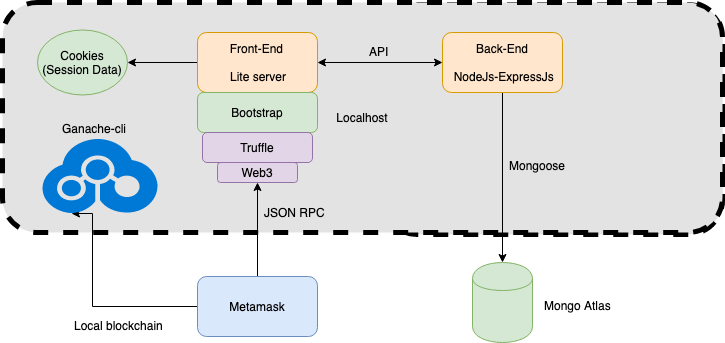

# Architecture
The following image is the proposed architecture

### Internal services (Localhost): 

* Ganache -> local blockchain emulator.
* Lite Server -> Light server running the Front-end
* Node / Express -> Server running the backend (Acts like an interface to persistence)

### Servicios externos: 

* Mongo Atlas -> No SQL database for users management and favourite products management.
* Metamask -> Interface for Ethereum. 
* CORS Plugin -> Plugin to modify headers in cross-origin http requests.  (Enables cross-origin request responses/queries)
